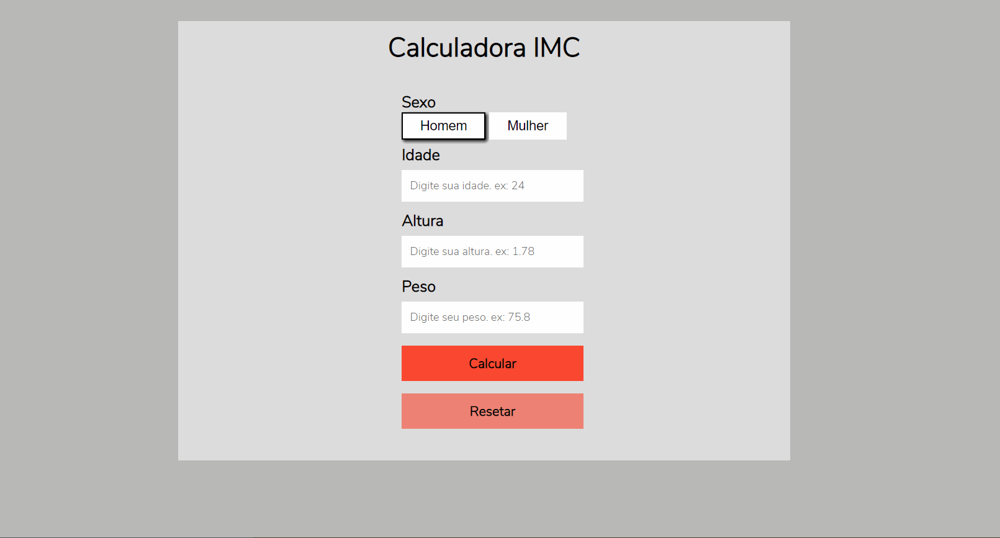
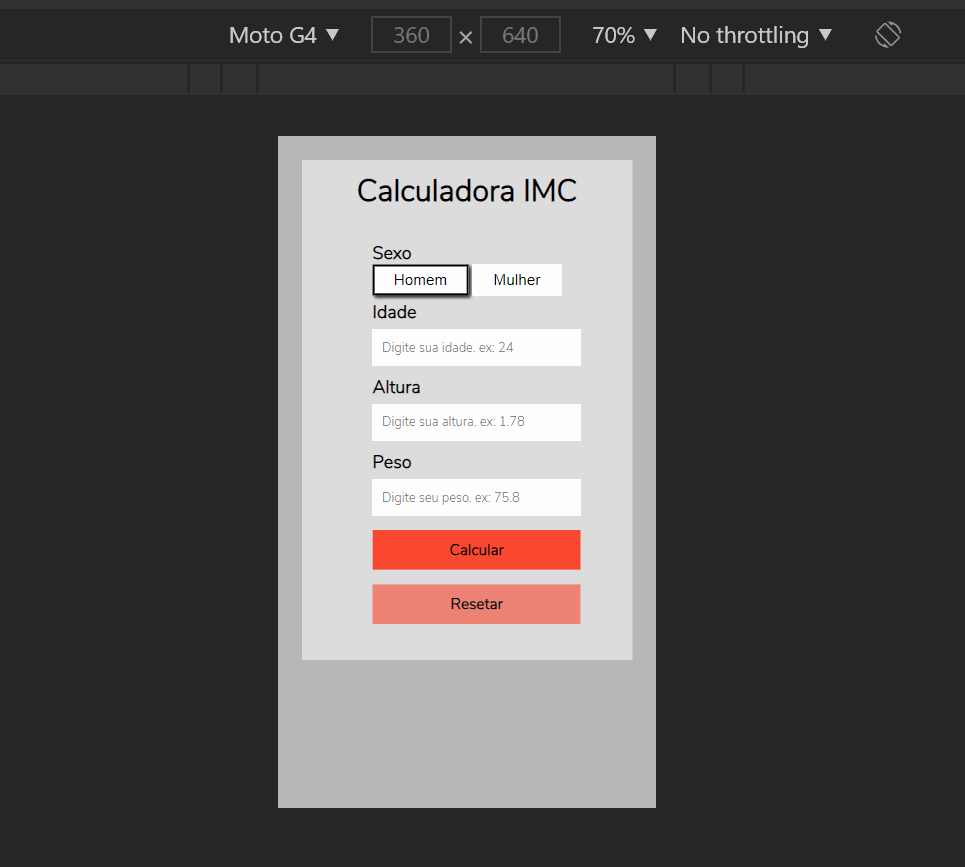

# Calculadora IMC

### - Após terminar os módulos de JavaScript básico e intermediário. Antes de entrar no módulo de JavScript Avançado decidi fazer uma exercício para praticar a manipulação do DOM através do JavaScript. Após alguns minutos pensando sobre o assunto, decidi fazer uma calculadora de IMC bem "clean".

### - Espero que gostem do resultado. Se tiverem dicas estou aberto a sugestões HeHeHe
 
### - Nesta aplicação foram usados as seguintes tecnologias:

#### *HTML.
#### *CSS.
#### *JavaScript

### Front End para desktop

### Front End para celular

### Acesse o site e veja você mesmo! Link: https://loving-stonebraker-57df44.netlify.app/

### Gostou do meu projeto? :D Entre em contato comigo! 
[Linkedin](https://www.linkedin.com/in/lucas-rosa-058683102/)  
[Email: lucasmetron@gmail.com](mailto:lucasmetron@gmail.com)
